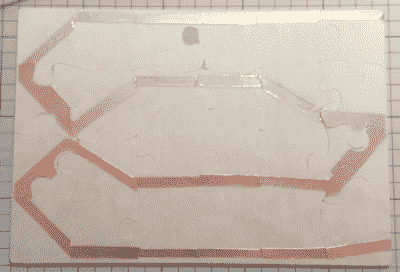

# 当电子设备这么说的时候，你的拼图就完成了

> 原文：<https://hackaday.com/2017/07/10/your-puzzles-done-when-the-electronics-says-so/>

当我们在网上组装拼图时，我们可以争分夺秒，但在现实世界中相互竞争呢？[自制垃圾]用他的[拼图计时器](https://www.hackster.io/H0meMadeGarbage/jigsaw-puzzle-timer-38117b)想出了最简单的解决方案，只有当拼图完全组装好时，计时器才会停止。

Copper strip on back of puzzle

他的简单解决方案是将铜箔带贴在零件的背面，并有重叠。他以蛇形的方式做这件事，以确保所有的作品都有一条带子。他使用的拼图带有一个特殊的容器来组装。在容器的两个角上，他又放了两片铜箔，在上面焊接电线。这两个就像一个开关。只有当拼图完成后，这两个部分才会通过拼图背面的蛇形带连接起来。

接下来，他需要一个计时器。来自字谜容器的两根电线连接到 Arduino UNO，它使用一个 [ILI9325 触摸面板 TFT 显示器](https://www.adafruit.com/product/335)来显示开始、停止和重置按钮，并显示经过的时间。当触摸屏显示“开始”时，按下该按钮，开始组装拼图。当最后一块插入时，蛇形铜带完成电路，只有这时 Arduino 程序才停止计时器。正如你从下面的视频中看到的，这个结果让拼图变得非常有趣。

自然，贴上铜带需要一些工作，你不太可能对有一千块的拼图这样做，但大多数在线拼图也没有多少块。重要的是比赛的乐趣，人们轮流比赛，无论如何你都希望它快一些。

如果你有一张打印好的照片，你想把它变成一块大小合适的拼图，那么你可以使用这个[在线程序生成一个 SVG 文件，告诉你的激光切割机](http://hackaday.com/2016/11/05/hackit-laser-cut-your-own-jigsaw-puzzle/)如何切割拼图。或者也许你更喜欢让一个机器人为你做这个拼图？在这种情况下，你可以从[thomasgruwez]的[拾取和放置拼图玩具辅助工具](http://hackaday.com/2015/08/01/it-sucks-to-pick-up-the-pieces/)开始。

> [在 Instagram 上查看此贴](https://www.instagram.com/p/BTtTHaEFAhj/?utm_source=ig_embed&utm_campaign=loading)[大女儿也在奋斗！
> 
> [自制垃圾](https://www.instagram.com/homemadegarbage/?utm_source=ig_embed&utm_campaign=loading) (@自制垃圾)于 <time style=" font-family:Arial,sans-serif; font-size:14px; line-height:17px;" datetime="2017-05-05T10:45:36+00:00">2017 年 5 月 5 日 PDT</time> 凌晨 3:45 分享的一个帖子](https://www.instagram.com/p/BTtTHaEFAhj/?utm_source=ig_embed&utm_campaign=loading)