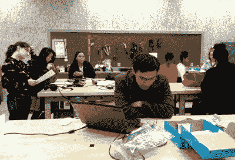
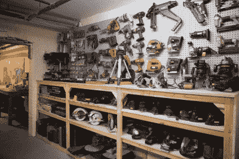

# 你早该去图书馆了

> 原文：<https://hackaday.com/2016/08/22/youre-overdue-for-a-visit-to-the-library/>

你上次去图书馆是什么时候？如果已经过了几年，图书馆可能和你记忆中的大不一样了。公共图书馆以跟上不断变化的技术而自豪，尤其是对他们所服务的社区有益的技术。无论你的年龄或兴趣如何，图书馆都是学习新技能、做研究或获得任何任务帮助的绝佳资源。毕竟，图书馆学是关于收集所有人类知识，并将其编入索引以便于查找。

不是研究人员，不是学生都没关系。图书馆的存在是为了在一个无阶级的环境中为每个人服务。最近几年，顾客们已经开始在图书馆寻找新兴的 DIY 文化。他们想学会让自己的生活变得更好。公共图书馆已经加快步伐来满足这一需求，增加新的馆藏资料，建设 makerspaces，并启动工具库。这还不包括不断增长的电子资源收藏。不知何故，他们在预算日益紧张的情况下设法做到了这一切。

本文的目的是探索各种类型的图书馆如何成为我们读者的宝贵资源。从公共图书馆系统到大学校园里杂乱无章的学术图书馆，各个层次的黑客和创客都可以找到自己想要的东西。

### 去图书馆，踩油门

The Boston Public Library. Image via [*Boston Magazine*](http://www.bostonmagazine.com/arts-entertainment/blog/2016/02/06/boston-public-library-love/)

在互联网之前，在 MSN Encarta 之前，在大英百科全书之前，有公共图书馆。也许 L 字让你回到了小学时代，那时你刚刚高到可以偷看卡片目录最上面的抽屉，翻阅手写的条目。也许你足够年轻，你一直都知道公共图书馆有免费的互联网接入和一排排可以用来玩《我的世界》和更新 Hackaday.io 的电脑

有人会说，互联网和电子阅读器的兴起让图书馆成为一个过时的概念，甚至是过时的。图书馆以与时俱进而自豪。尽管图书馆在流行文化中占有一席之地，但它不仅仅是过期的书和因为说话而被斥责。多年来，他们在书籍的同时提供流行的电影和音乐(现在作为流媒体资源)，并且他们继续跟上不断变化的技术。他们不仅在预算允许的情况下购买新技术，大多数公共图书馆还提供免费课程来帮助解释新技术。

长期以来，公共图书馆一直是“自己动手”者的良好起点。找个时间看看参考资料。你可以找到一本维修手册来修理你的汽车，或者最新的国家电气规程手册。买不起[电子艺术第三版](https://www.worldcat.org/title/art-of-electronics/oclc/904400036?referer=br&ht=edition)或者最新的树莓派食谱？图书馆支持你。那些我们认为你应该读的[书也在书库里。无论你喜欢阅读新技能还是看 DVD，图书管理员都可以带你找到合适的资料——这是图书馆学令人兴奋的一部分。图书馆员如此热爱信息共享和学习，以至于他们会用有限的预算为创客空间腾出空间也就不足为奇了。](http://hackaday.com/tag/books-you-should-read/)

### 为制作创造空间

The DC public library’s FabLab. Image via [*The Atlantic*](http://www.theatlantic.com/technology/archive/2016/03/everyone-is-a-maker/473286/)

我在当地公共图书馆中心分馆新扩建的创客空间写这篇文章。大约一年前，这个图书馆在主房间的中间设立了一个小的创客空间。一大堆关于制造和机器人技术的书籍摆在外面，吸引着人们。在改造项目中，创客空间扩大了六倍，这部分归功于当地一家工程公司的慷慨捐赠。现在，你可能会在创客空间中找到的大多数设备都在这里——3D 打印机、激光切割机、数控机床、缝纫机、手工工具、烙铁——而且都完全免费使用。多亏了前面提到的捐赠，3D 打印机细丝可以免费使用，至少现在是这样。

如果你无法证明 makerspace 会员资格的成本足以为你的洗衣机打印一个一次性的替代品，或者按照你家乡的形状制作一个砧板，那就去图书馆吧。你不仅可以几乎不花一分钱完成你的项目，还会有大量的知识和乐于助人的人来指导你。

The Round Reading Room of King’s College London’s Maughan Library. Image via [Wikipedia](https://en.wikipedia.org/wiki/Academic_library#/media/File:Int%C3%A9rieur_de_la_Maughan_Library.png)

### 让我教你学术图书馆

不是你们当地高校的持证学生？视库而定，可能无所谓。我已经在社区大学上课好几年了。我尽可能经常地参观他们令人印象深刻的图书馆，不管我是否在上课。有时候，我去那里只是为了享受我周围的知识，或者在二楼安静的房间里，在震耳欲聋的寂静中思考我的存在。

公共图书馆和学术图书馆有一些重要的区别。大学图书馆要么是普通知识图书馆，要么是专门为某一学科服务的图书馆，比如工程或法律图书馆。与公共图书馆相比，大学图书馆倾向于拥有更多的各种类型的资料，通常有学校使用的教科书的副本。在美国，他们使用[国会图书馆分类系统](https://www.loc.gov/catdir/cpso/lcco/)，与[杜威十进制系统](https://www.oclc.org/dewey/features/summaries.en.html)相比，该系统允许在给定收藏中进行更细微的分类。虽然公共图书馆提供对 JSTOR 等数据库和牛津英语词典等参考资料的访问，但学术借书证是你进入更多数据库和学术期刊的通行证。

### 看看这个电锯

在过去十年左右的时间里，美国的公共图书馆已经开始提供更多种类的资料供借阅，比如瓦特计。一些图书馆提供更多样化的物品，如乐器、游戏机、钓鱼竿和艺术品。一些公共图书馆甚至创建了单独的工具库来补充他们的产品。顾客可以借出各种工具和设备，就像他们借一本书或一张 DVD 一样。大多数图书馆都免费提供工具借阅服务——你只需要出示你的借书证，或许还有居住证明。

A well-organized collection at [Toronto Tool Library](http://torontotoollibrary.com/)

也有独立于公共图书馆系统运行的社区工具库。[这是全球已知刀具库的地图](http://localtools.org/find/)。如果你所在的城市没有，考虑建立一个。你可能会对来自社区的回应和支持感到惊讶。

我们都有自己想开始或着手或完成的项目，如果我们能借一把辐条剃须刀或电锯或一些内卡钳就好了。出于同样的原因，我们可能都有可以捐给工具库的东西，可能是一把简单的螺丝刀，也可能是一周几个小时的志愿者时间。

如果你不确定如何开始，这里有一个由西西雅图工具库整理的指南。它有示例表单和文档，可以根据您的需要进行编辑。哦，别忘了[买一些责任险](http://hackaday.com/2016/07/19/hackerspaces-are-hard-insurance/)来保护自己。

工具库对社区来说是一个福音，不管是谁运行的。当人们能够获得他们需要的东西来改善和修理房屋或解决他们自己的交通问题时，世界会变得更美好。

图书馆的使命没有改变——他们寻求为社会所有成员提供获取信息的途径。随着免费在线信息的兴起，图书馆已经现代化，包括在线访问，并继续提供非免费的渠道:音频和视频媒体，期刊订阅，手册和文档，电子设备，是的，甚至工具。公共图书馆在我们心目中的首选资源列表中应该占据更高的位置，它是一个贡献我们的时间和才能来回报当地社区的好地方。