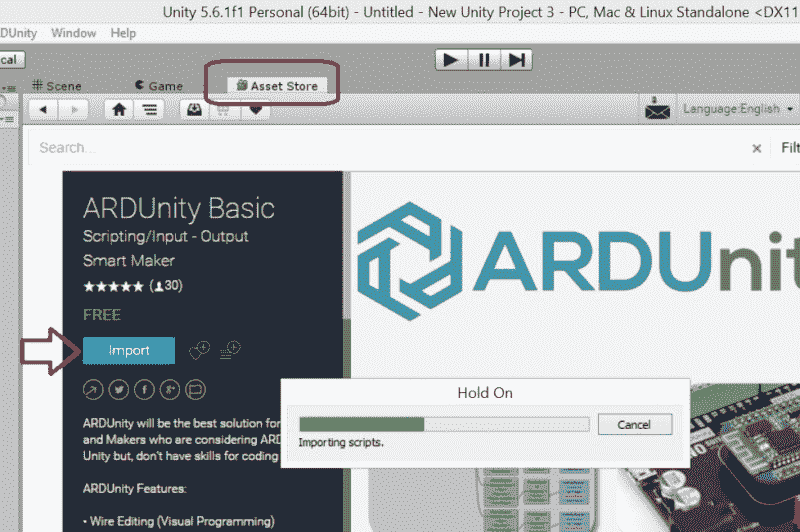
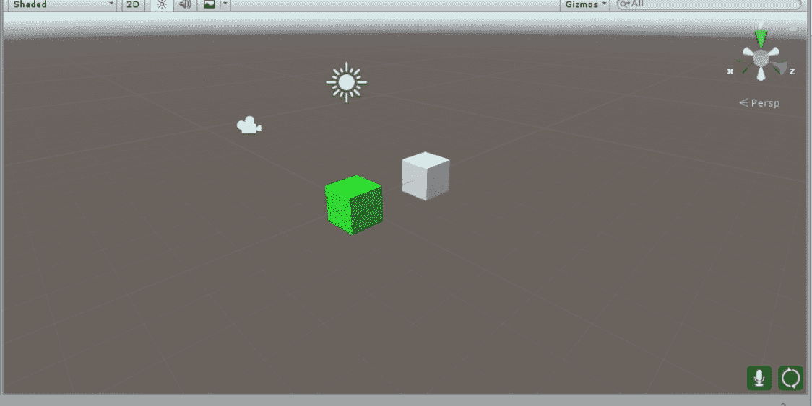

# 你是唯一一个不玩团结的人

> 原文：<https://hackaday.com/2017/06/21/youre-the-only-one-not-playing-with-unity/>

不久前，人们还可以推测大多数黑客并不是狂热的视频游戏玩家。我们大部分空闲时间都在拆东西，摆弄微控制器，阅读关于 Hackaday.com 的最新文章。当我们想到视频游戏时，我们的神经元通常会朝着模拟单板计算机上的控制台的方向放电，例如树莓 Pi 或 Beaglebone。或者甚至在 FPGA 上模拟实际的控制台处理器。我们很少冒险进入制作现代视频游戏的 3D 程序。如果我们不能导出一个。总之，我们不感兴趣。这不是我们的包。

Oculus Rift 改变了这一点。VR 头戴设备最初是为 3D 视频游戏而发明的，但很快成为全世界黑客的宠儿。虚拟现实技术不仅仅是视频游戏，它还为许多领域带来了机遇，如房地产、建筑、产品可视化、教育、社交……不胜枚举。

在早期，Oculus 团队与 Unity 的人们聚在一起，让视频游戏制造商更容易为 Rift 制作内容。Unity 是一个游戏引擎，设计的学习曲线很浅，可以免费用于非商业用途。Oculus Rift 可以集成到一个 Unity 环境中，只需检查一个设置并导入一个小软件包，可以在 Oculus 网站上找到。这使得任何对 VR 技术感兴趣的人都很容易获得一个裂缝，并开始泵出内容。

黑客们更进一步，编写了允许 Unity 与 Arduino 通信的脚本。VR 好玩。但是虚拟现实加上物理现实就是太令人兴奋了！在本文中，我们将指导您设置 Oculus Rift 和 Unity 游戏引擎，以便通过 Arduino 与外界通信。

## 现成的选项

如果你进入 Unity 资产页面，搜索 Arduino，[你会看到几个选项](https://www.assetstore.unity3d.com/en/#!/search/page=1/sortby=relevance/query=arduino)。遗憾的是，搜索树莓派没有任何结果。有一些通用串行通信选项，如[简单串行](https://leithigamedev.jimdo.com/)和 [SD 串行](https://www.assetstore.unity3d.com/en/#!/content/12652)，但这些选项不是免费的，从表面上看，似乎没有得到很好的支持。 [Unidino](http://www.uniduino.com/) 看起来很有前景，但是三十块钱，论坛上也没什么活动。雨天玩 ARDunity 是显而易见的选择。有一个免费版本仍然有很多功能可以试验，并且它得到了很好的支持和记录。它更像是以所见即所得的风格编写的，可能会让编码人员感到不快，但在有人推出更高级的版本之前，这已经足够了。

## 入门指南

我们假设你的电脑上已经安装了 Arduino 和 Oculus。如果你没有 Oculus Rift，我们建议你去 Oculus 网站[安装软件](https://www3.oculus.com/en-us/setup/)。它将允许您通过 Oculus 运行时测试 Unity/Arduino 通信，即使您没有硬件。这样，当你拿到耳机时，你就什么都不用做了。只需执行。exe，你就可以在 VR 里看到你的作品了。请注意，它们用于防止软件安装在不符合最低要求的计算机上。Oculus 已经缓和了这种麻烦，现在允许该软件安装在大多数电脑上，包括笔记本电脑！

设置 Unity 非常简单——只需访问网站并[下载安装程序](https://store.unity.com/download?ref=personal)。本文时间的最新版本是 5.6.1。你会想要个人版的——它大约有 5g，所以给它一些时间下载。安装完成后，前往 Oculus 网站并获取 [Unity tools 导入包](https://developer.oculus.com/downloads/package/oculus-utilities-for-unity-5/)。

打开 Unity，打开一个新项目。然后返回 Unity 资产商店，安装 [ARDunity 基本导入包](https://www.assetstore.unity3d.com/en/#!/content/60643)。这将打开 Unity，您应该会看到一个名为 Asset Store 的选项卡。单击选项卡，然后导入包。然后进入*编辑->项目设置->播放器*，设置 API **兼容性**等级为。**净 2.0** 。这将清除您在屏幕底部看到的错误。然后在**其他设置**下，务必选择**虚拟现实支持**选项。

现在，通过进入*资产—>导入包—>定制包*导入 Oculus 包，并指向您之前下载的 Oculus 包。如果需要，重启 Unity 程序。

## 把所有的放在一起

此时，一切都应该设置好了，让 Unity 通过 Oculus Rift 与您的 Arduino 对话。在 D2 上放一个 LED，注意你的通讯端口。从项目选项卡(左下方)，展开文件夹*ARDunity—>示例—>LED—>数字*。双击最后一个例子-**反应触发器(数字化)。统一**。

这将加载示例。现在，您应该在视图窗口中看到两个立方体，并且在左上角的 hierarchy 选项卡下看到一个名为 ARDunity 的新文件夹。点击 ARDunity，你会看到检查器标签(最右边)变成包括一个按钮，上面写着“导出草图”。点击按钮，它会将 Arduino 草图导出到

View of scene after opening LED example

你的选择。的。ccp 和。h 文件将会自动生成，还有一些其他的依赖项。我不应该告诉你到处看看，但不要忘记在你吃饱后编译并上传它。

在导出草图按钮的正下方是通信串行(脚本)窗口。搜索并选择适合您的通信端口 Arduino。找到你的通讯端口后，点击主场景窗口顶部的播放按钮。一旦你这样做了，你会看到一个“连接”按钮出现在导出草图的地方。继续连接。现在点击主视窗上方的场景标签。这将允许你操作立方体。去抓住白色的立方体，把它放到绿色的立方体里。如果你做的一切都正确，当两个立方体碰撞时，你会看到你的 LED 灯。

你脑袋里的齿轮现在应该正在转动…如果你能在游戏引擎里切换 IO；你可以做一些非常酷的事情！但是我们只是触及了表面。让我们在虚拟现实中实现它吧！

## 进入裂缝

为了进入虚拟世界，你需要一些东西。一个是角色控制器，另一个是可以行走的东西。如果你还没有点击播放按钮，请再次点击。这将断开一切，并允许您编辑世界。转到*游戏对象–>3D 对象–>平面*并调整平面，使两个立方体悬停在其上方。然后展开 ARDuino 并展开 OVR 文件夹到*OVR->预设*。选择**ovrplayercontroller . prefab**并将其拖动到左上角的主层次中。你会看到玩家控制器出现在主场景窗口中。将它拖离立方体，然后在右侧的检查器选项卡下，取消选择 OVR 播放器控制器(脚本)部分中的使用配置文件数据选项。

现在，在层级选项卡下选择 ARDuino，按播放，然后连接。如果你连接了 Oculus Rift，你应该可以戴上它，跑进绿色立方体，点亮 Arduino 上的 LED。如果您没有，只需使用箭头键来做同样的事情。

## 结论

那么，你会怎么做呢？最大的亮点是触觉反馈。想象你有一面墙、一张桌子或类似的东西，而不是一个立方体。让 Arduino 在您触摸或撞到物体时触发某种类型的反馈。

深入研究代码，让我们知道任何错误或改进。请务必遵循一些[和其他例子](https://sites.google.com/site/ardunitydoc/getting-started/run-examples)，并查看下面的视频进行演示。如果你用 Unity 做了什么很酷的事情，请在评论中告诉我们。

 [https://www.youtube.com/embed/QF9QGELvIUU?version=3&rel=1&showsearch=0&showinfo=1&iv_load_policy=1&fs=1&hl=en-US&autohide=2&wmode=transparent](https://www.youtube.com/embed/QF9QGELvIUU?version=3&rel=1&showsearch=0&showinfo=1&iv_load_policy=1&fs=1&hl=en-US&autohide=2&wmode=transparent)

